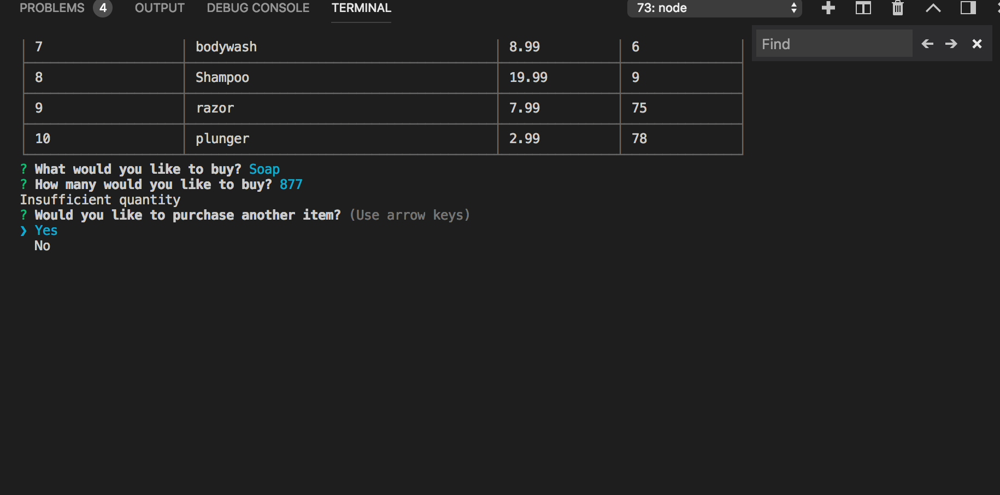
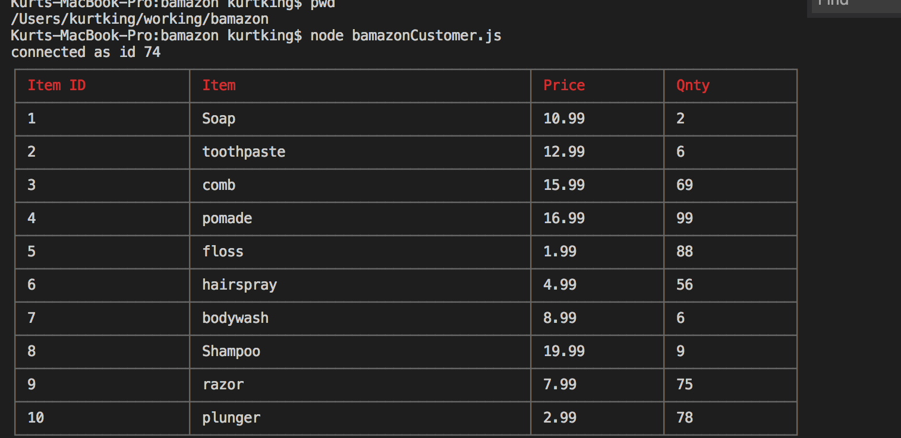
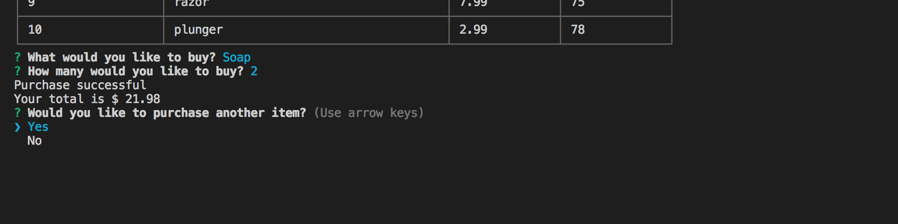
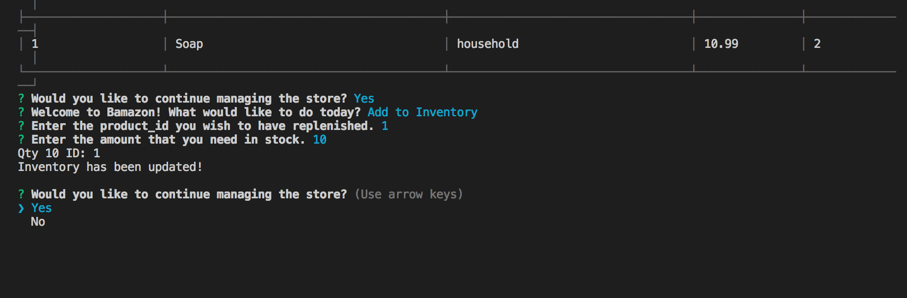

# bamazon

This is a project using node,mySQL and javascript.

* use the prompts from the inquirier package to naviagte through the products and make selections 

* in the terminal you will be able to use data from the connected database which is bamazonDB

*if you run the manager js file you will be able to do different things with the products. using a switch you can call different commands to take different action on the products. 

 screen shot of insufficent quantity

screen shot of list of products 

screen shot of logging in as manager 

screen shot of completed purchase 

screen shot of updated inventory 

screen shot of low stock 

